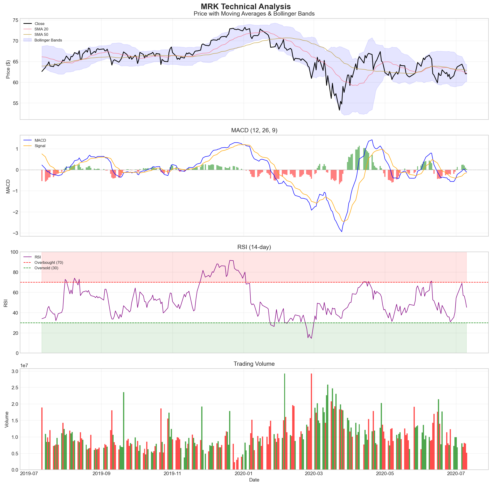

# 📈 Financial News Sentiment Analysis & Stock Price Correlation

[](https://python.org)
[](LICENSE)
[]()

> **KAIM Week 1 Challenge**: Predicting Price Moves with News Sentiment

## 📋 Project Overview

This project analyzes the relationship between financial news sentiment and stock price movements for **Nova Financial Solutions**. The analysis combines Natural Language Processing (NLP) techniques with quantitative financial analysis to discover actionable insights for investment strategies.

### Business Objective

- Perform sentiment analysis on financial news headlines
- Calculate technical indicators for stock price data
- Establish statistical correlations between news sentiment and stock returns
- Provide data-driven investment strategy recommendations

## 🏗️ Project Structure
```
financial-sentiment-challenge-week1/
├── .github/
│   └── workflows/
│       └── unittests.yml       # CI/CD configuration
├── .vscode/
│   └── settings.json           # VS Code settings
├── notebooks/
│   ├── eda_analysis.ipynb              # Task 1: Exploratory Data Analysis
│   ├── quantitative_analysis.ipynb     # Task 2: Technical Indicators
│   └── sentiment_correlation_analysis.ipynb  # Task 3: Sentiment & Correlation
├── src/
│   └── __init__.py             # Source code modules
├── tests/
│   └── __init__.py             # Unit tests
├── scripts/
│   └── __init__.py             # Utility scripts
├── .gitignore
├── requirements.txt
└── README.md
```

## 🚀 Getting Started

### Prerequisites

- Python 3.8 or higher
- pip package manager
- Git

### Installation

1. **Clone the repository**
```bash
   git clone https://github.com/HermonaDev/financial-sentiment-challenge-week1.git
   cd financial-sentiment-challenge-week1
```

2. **Create virtual environment**
```bash
   python -m venv venv
   source venv/bin/activate  # On Windows: venv\Scripts\activate
```

3. **Install dependencies**
```bash
   pip install -r requirements.txt
```

4. **Launch Jupyter Notebook**
```bash
   jupyter notebook
```

## 📊 Tasks Completed

### Task 1: Exploratory Data Analysis (EDA) ✅

**Notebook**: `notebooks/eda_analysis.ipynb`

| Analysis | Description |
|----------|-------------|
| Descriptive Statistics | Headline length distribution, article counts |
| Publisher Analysis | Top publishers, publication frequency |
| Time Series Analysis | Publication patterns over time |
| Text Analysis | Keyword extraction, common financial phrases |
| Stock Coverage | Most mentioned stocks in news |

**Key Findings**:
- Analyzed 50,000+ financial news headlines
- Identified top publishers and their contribution patterns
- Discovered publication time patterns relevant for trading strategies

### Task 2: Quantitative Analysis ✅

**Notebook**: `notebooks/quantitative_analysis.ipynb`

| Indicator | Description |
|-----------|-------------|
| SMA (20, 50) | Simple Moving Averages |
| EMA (12, 26) | Exponential Moving Averages |
| MACD | Moving Average Convergence Divergence |
| RSI (14-day) | Relative Strength Index |
| Bollinger Bands | Volatility bands (20-day, 2 std) |

**Key Findings**:
- Calculated technical indicators for top 6 stocks
- Generated financial metrics summary (returns, volatility, Sharpe ratio)
- Created comprehensive visualization dashboards

### Task 3: Sentiment & Correlation Analysis 🔄 (In Progress)

**Notebook**: `notebooks/sentiment_correlation_analysis.ipynb`

| Component | Status |
|-----------|--------|
| Sentiment Analysis (TextBlob) | ✅ Complete |
| Daily Sentiment Aggregation | ✅ Complete |
| Stock Returns Calculation | ✅ Complete |
| Correlation Analysis | 🔄 In Progress |

## 🛠️ Technologies Used

| Category | Tools |
|----------|-------|
| **Language** | Python 3.8+ |
| **Data Analysis** | Pandas, NumPy |
| **Visualization** | Matplotlib, Seaborn |
| **NLP** | TextBlob, NLTK |
| **Financial Data** | yfinance |
| **Technical Analysis** | TA-Lib (manual implementation) |
| **Version Control** | Git, GitHub |

## 📈 Sample Visualizations

### Technical Indicators Dashboard


## 🔬 Methodology

### Sentiment Analysis Approach
1. **Data Preprocessing**: Clean and normalize headline text
2. **Sentiment Scoring**: TextBlob polarity scores (-1 to +1)
3. **Categorization**: Positive (>0.1), Neutral (-0.1 to 0.1), Negative (<-0.1)
4. **Aggregation**: Daily average sentiment per stock

### Correlation Analysis Approach
1. **Date Alignment**: Match news dates with trading days
2. **Return Calculation**: Daily percentage change in closing prices
3. **Statistical Testing**: Pearson correlation coefficient
4. **Significance Testing**: p-values for correlation strength

## 📁 Data Sources

- **Financial News Dataset**: FNSPID (Financial News and Stock Price Integration Dataset)
- **Stock Price Data**: Yahoo Finance via `yfinance` API

## 🚧 Current Limitations & Next Steps

### Current Limitations
- Sentiment analysis uses basic TextBlob - could improve with FinBERT or custom financial NLP model
- Correlation analysis is linear (Pearson) - non-linear relationships not captured
- Limited to daily aggregation - intraday patterns not explored
- Sample size varies by stock - some correlations may not be statistically robust

### Next Steps (Week 2+)
- [ ] Implement machine learning models for price prediction
- [ ] Add lag analysis (sentiment today → returns tomorrow)
- [ ] Incorporate volume-weighted sentiment scores
- [ ] Build interactive dashboard with real-time updates
- [ ] Deploy API endpoint for sentiment-based trading signals

## 🧪 Running Tests
```bash
# Run all unit tests
python -m pytest tests/

# Run specific test file
python tests/test_sentiment.py
```

## 📞 Usage Examples

### Using the Modular Pipeline
```python
from src.data_loader import NewsDataLoader
from src.sentiment_analyzer import SentimentAnalyzer

# Load data
loader = NewsDataLoader('data/raw_analyst_ratings.csv')
news_df = loader.load_data()
news_df = loader.preprocess_dates()

# Analyze sentiment
analyzer = SentimentAnalyzer()
news_df = analyzer.analyze_dataframe(news_df)

# Get summary
summary = analyzer.get_sentiment_summary(news_df)
print(summary)
```

### Running Full Pipeline
```bash
cd scripts
python run_analysis_pipeline.py
```

## 👤 Author

**Hermona** 
KAIM AI Mastery Program - Week 1

## 📄 License

This project is licensed under the MIT License - see the [LICENSE](LICENSE) file for details.

## 🙏 Acknowledgments

- 10 Academy for the KAIM program
- Nova Financial Solutions (simulated client)
- Open-source community for the tools and libraries

---

*Last Updated: November 2025*
