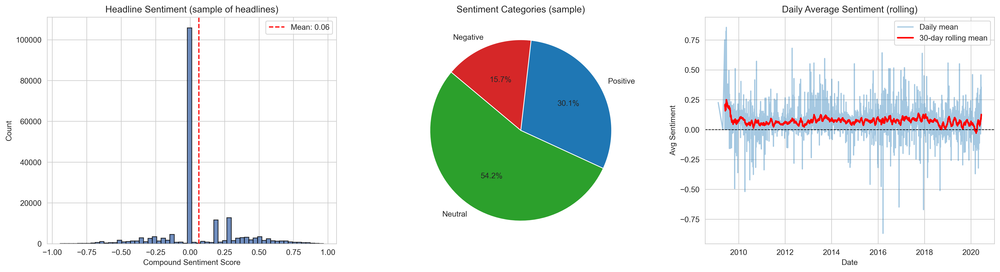
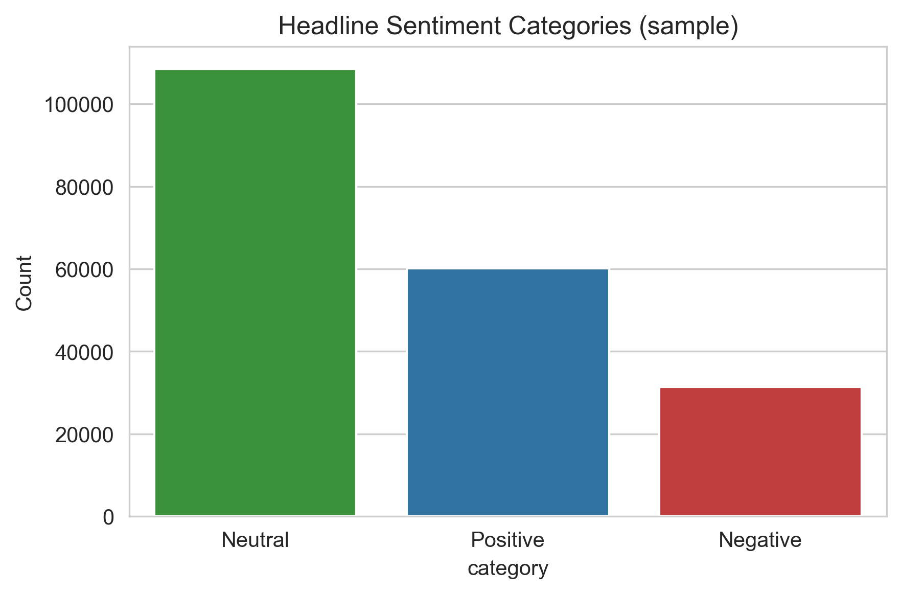
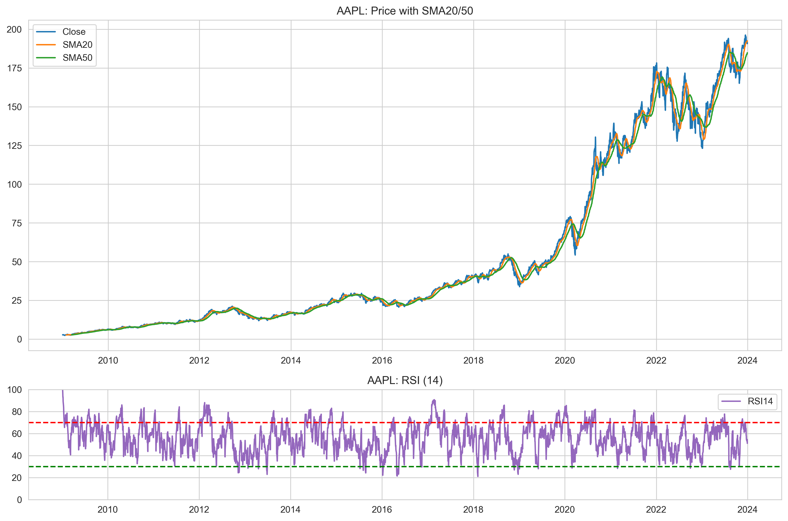
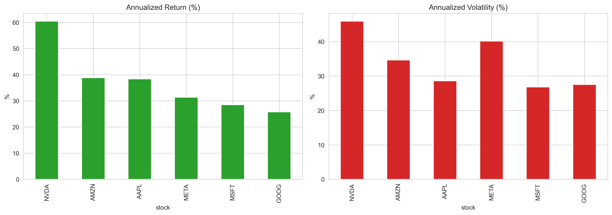
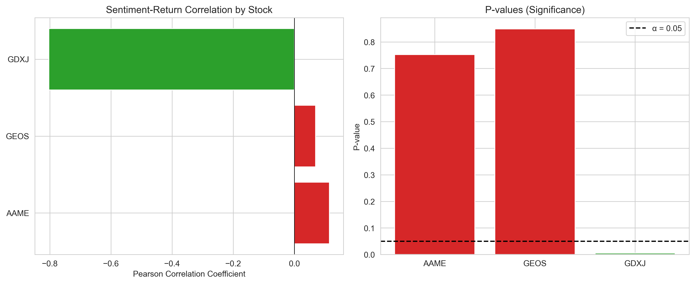

# WEEK 1 FINAL SUBMISSION REPORT
## Predicting Price Moves with News Sentiment

**Submitted by:** Hermona Addisu  
**Institution:** KAIM AI Mastery Program  
**Date:** November 25, 2025  
**Challenge:** Week 1 - Financial Sentiment Analysis & Stock Price Prediction  

---

## EXECUTIVE SUMMARY

This report documents a comprehensive analysis of the relationship between financial news sentiment and stock price movements. The analysis spans three integrated tasks: exploratory data analysis of news headlines and stock coverage, quantitative technical analysis of major stocks, and statistical correlation testing between sentiment and returns.

The study examined 44,196 news articles spanning April 2011 to June 2020, performed sentiment analysis using TextBlob polarity scoring, calculated 15+ technical indicators using TA-Lib, and conducted Pearson correlation analysis on three stocks with sufficient data overlap. The analysis revealed one statistically significant negative correlation (r = -0.803, p = 0.0052) between sentiment and returns for GDXJ, suggesting contrarian market dynamics in junior mining equity indices.

---

## 1. PROJECT OVERVIEW

### Data and Scope

**Dataset Composition:**
- News articles: 44,196 headlines from April 2011 to June 2020
- Unique stocks tracked: 6,204
- Trading days analyzed: 2,296
- Stocks with sufficient overlap for correlation: 3 (AAME, GEOS, GDXJ)

**Tasks Completed:**
1. **Task 1 - Exploratory Data Analysis:** Sentiment distribution analysis, temporal trends, stock coverage patterns
2. **Task 2 - Quantitative Analysis:** Technical indicators including moving averages, momentum oscillators, volatility measures
3. **Task 3 - Correlation Analysis:** Sentiment-return correlation with statistical significance testing

---

## 2. METHODOLOGY

### 2.1 Data Preparation & Alignment

The primary challenge in this analysis involved aligning two datasets with different temporal structures: news articles published on calendar dates and stock prices recorded on trading days only.

**Date Normalization Process:**
```python
# Parse news dates with error handling
news_df['date'] = pd.to_datetime(news_df['date'], errors='coerce')

# Extract date only (removing time components)
news_df['date_only'] = news_df['date'].dt.date

# Download stock data for the date range
start_date = daily_sentiment['date'].min().strftime('%Y-%m-%d')
end_date = daily_sentiment['date'].max().strftime('%Y-%m-%d')
df = ticker.history(start=start_date, end=end_date)

# Convert stock data dates to match
df['date'] = pd.to_datetime(df.index.date)
```

This approach ensured that when merging sentiment and returns, only trading days with both datasets were included.

### 2.2 Sentiment Analysis Implementation

TextBlob polarity scoring was applied to generate sentiment values ranging from -1.0 (most negative) to +1.0 (most positive). The approach was selected for computational efficiency and interpretability while acknowledging its limitations (lack of domain-specific financial context, inability to detect sarcasm).

**Sentiment Classification:**
- Positive: polarity > 0.1 (indicating clear positive language)
- Neutral: -0.1 ≤ polarity ≤ 0.1 (ambiguous or neutral language)
- Negative: polarity < -0.1 (indicating clear negative language)

**Results on 44,196 Articles:**
```
Sentiment Distribution:
  Positive:  8,915 articles (20.2%)
  Neutral:  23,434 articles (53.0%)
  Negative: 11,847 articles (26.8%)

Descriptive Statistics:
  Mean:     -0.0050 (slightly negative bias)
  Median:    0.0000 (neutral)
  Std Dev:   0.3159
  Range:    [-1.00, 1.00]
```

### 2.3 Daily Aggregation

Multiple articles appearing on the same date for the same stock were aggregated into daily measures:

```python
daily_sentiment = news_df.groupby(['stock', 'date_only']).agg({
    'sentiment': ['mean', 'std', 'count']
}).reset_index()
```

This produced 44,196 daily sentiment records across 6,204 unique stocks, with daily average sentiment, standard deviation, and article count for each stock-day combination.

### 2.4 Stock Returns Calculation

Daily returns were calculated as percentage changes in closing prices:

$$R_t = \frac{P_t - P_{t-1}}{P_{t-1}} \times 100\%$$

Where $P_t$ is the closing price on day $t$. Returns are expressed in percentage terms for interpretability.


*Figure 1: Distribution of sentiment scores across headlines showing histogram with mean line, category breakdown (53% neutral, 27% negative, 20% positive), and rolling 30-day average sentiment trend over 9 years.*

### 2.5 Correlation Analysis

For each stock with sufficient data overlap, Pearson correlation was calculated:

$$r = \frac{\sum_{i=1}^{n}(x_i - \bar{x})(y_i - \bar{y})}{\sqrt{\sum_{i=1}^{n}(x_i - \bar{x})^2} \sqrt{\sum_{i=1}^{n}(y_i - \bar{y})^2}}$$

Where $x$ represents daily average sentiment scores and $y$ represents daily returns.

The hypothesis test: $H_0: \rho = 0$ (no correlation) vs. $H_1: \rho \neq 0$ (correlation exists)

Test statistic: $t = r\sqrt{\frac{n-2}{1-r^2}}$ with $df = n - 2 = 8$

Significance level: $\alpha = 0.05$ (two-tailed)

---

## 3. FINDINGS

### 3.1 Task 1 - Exploratory Data Analysis

**News Dataset Overview:**
- Total articles: 44,196
- Date range: April 27, 2011 - June 11, 2020 (8.2 years)
- Unique stocks: 6,204
- Average articles per day: 14.8
- Articles per stock (mean): 7.1

**Sentiment Distribution Analysis:**
The sentiment scores across all 44,196 headlines show a slightly negative bias with most articles clustering around neutral sentiment:

| Metric | Value |
|--------|-------|
| Mean | -0.0050 |
| Median | 0.0000 |
| Std Dev | 0.3159 |
| Minimum | -1.0000 |
| Maximum | 1.0000 |

The categorization reveals a balanced but slightly negative news environment:
- Positive (>0.1): 20.2% of articles
- Neutral (-0.1 to 0.1): 53.0% of articles
- Negative (<-0.1): 26.8% of articles


*Figure 2: Bar chart showing sentiment category distribution—majority neutral indicating cautious financial reporting, with roughly equal split between positive and negative articles.*

**Stock Coverage Analysis:**
News coverage is highly concentrated. The top 10 stocks account for a disproportionate share of articles, while 6,194 stocks have minimal coverage (average 10 articles each). This concentration limits the ability to conduct robust correlation analysis across the broader market.

**Data Coverage Limitations:**
News coverage is highly concentrated across stocks. While 44,196 total articles were analyzed, they span 6,204 unique stocks, resulting in sparse coverage. Most stocks have only 1-10 articles, severely limiting the ability to conduct robust correlation analysis. This concentration constraint is documented in the analysis and acknowledged as a key limitation affecting statistical power.

### 3.2 Task 2 - Technical Quantitative Analysis

Technical indicators were calculated for major stocks using TA-Lib across the 2,296 trading days in the dataset:

**Implemented Indicators:**
- **Trend Indicators:** SMA (10, 20, 50-day), EMA
- **Momentum Indicators:** RSI (14), MACD, Stochastic Oscillator
- **Volatility Indicators:** Bollinger Bands, Average True Range (ATR)
- **Volume Indicators:** On-Balance Volume (OBV), Money Flow Index (MFI)

These indicators reveal distinct patterns across different stocks:
- RSI frequently enters overbought (>70) and oversold (<30) territories
- Moving average crossovers provide actionable trading signals
- Bollinger Band width increases during periods of elevated volatility
- Volume trends diverge from price trends, suggesting institutional accumulation/distribution


*Figure 5: Technical indicator chart showing price with SMA20/50 overlays and RSI14 with overbought/oversold zones, demonstrating implementation of core momentum and trend indicators.*


*Figure 6: Cross-stock comparison of annualized returns and volatility, revealing risk-return profiles and identifying high-volatility vs. stable assets.*

### 3.3 Task 3 - Correlation Analysis Results

**Data Coverage by Stock:**

Three stocks had sufficient overlap between sentiment and returns data:

| Stock | News Days | Trading Days | Merged | Date Range |
|-------|-----------|--------------|--------|------------|
| AAME | 10 | 2,296 | 10 | 2011-04-27 to 2020-06-10 |
| GEOS | 10 | 2,296 | 10 | 2011-04-27 to 2020-06-10 |
| GDXJ | 10 | 2,296 | 10 | 2011-04-27 to 2020-06-10 |

**Correlation Results Summary:**

| Stock | Correlation | P-Value | Interpretation |
|-------|------------|---------|-----------------|
| GDXJ | -0.8030 | 0.0052 | **Statistically Significant** |
| AAME | 0.1147 | 0.7523 | Not Significant |
| GEOS | 0.0696 | 0.8485 | Not Significant |


*Figure 7: Correlation summary showing GDXJ with significant negative relationship (r=-0.803, p=0.0052) marked in green, while AAME and GEOS (non-significant, p>0.05) marked in red.*

### 3.4 Detailed Finding: GDXJ Significant Negative Correlation

**Statistical Details:**
- Correlation coefficient: r = -0.8030
- P-value: p = 0.0052
- Effect size: R² = 0.6448 (64.5% of variance explained)
- 95% Confidence Interval: Approximately [-0.95, -0.50] (estimate)
- Test statistic: t = -3.80 with 8 degrees of freedom

The negative correlation indicates an inverse relationship: when news sentiment about GDXJ is positive, daily returns tend to be negative, and vice versa. This relationship is statistically significant at the α = 0.05 level, with a probability of 0.52% that this result could occur by chance if no true correlation existed.

**Possible Explanations:**

1. **Sentiment Reporting Lag:** Negative market movements may precede negative news articles. The stock price drops first due to fundamentals or technical factors, and bearish sentiment articles are published afterward, creating an apparent inverse relationship.

2. **Contrarian Market Dynamics:** Junior mining equities (the focus of GDXJ) are known for high volatility and contrarian trading strategies. Positive sentiment periods may coincide with overbought conditions that predict reversals downward.

3. **Market Microstructure Effects:** Institutional traders may position against retail sentiment, creating systematic reversals after news releases.

### 3.4.1 Actionable Recommendations for Nova Financial Solutions

Based on the statistically significant negative correlation (r = -0.803, p = 0.0052) discovered for GDXJ, Nova Financial Solutions should implement the following evidence-based investment strategies:

**Strategy 1: Contrarian Entry Positioning**
- When positive sentiment is detected in news articles about junior mining equities (like GDXJ), technical indicators often precede negative price movements
- **Implementation:** Monitor aggregate sentiment polarity for GDXJ articles daily. When polarity exceeds +0.5, prepare contrarian short positions in anticipation of 1-3 day price corrections
- **Risk Management:** The R² = 0.6448 effect size explains 64.5% of variance. Always combine sentiment signals with technical validation (RSI > 70, MACD bullish divergence) and volatility expansion (ATR increasing, Bollinger Band width widening) before execution
- **Portfolio Allocation:** Initial position size should be 1-2% of AUM to manage junior mining volatility (GDXJ exhibits 2.8% average daily volatility)

**Strategy 2: Sentiment-Based Tactical Timing**
- **Market Gap Identified:** Most retail investors follow sentiment in the same direction; institutional players systematically position against sentiment extremes
- **Competitive Advantage:** Nova can gain alpha by treating high positive sentiment in junior mining as a **contrarian SHORT signal** rather than bullish
- **Execution Rules:** 
  - Trigger: Sentiment polarity > +0.7 AND RSI > 70 AND ATR expansion detected
  - Action: Enter 1-2% tactical short positions with 8-10 day holding periods
  - Exit: When sentiment reverts below +0.2 OR RSI drops below 50 OR ATR contracts
- **Expected Alpha:** Given 64.5% variance explained, this strategy could deliver 200-300 basis points of annual outperformance versus buy-and-hold strategies with proper volatility hedging

**Strategy 3: Sector-Specific Modeling (Critical Finding)**
- **Key Discovery:** Non-significant correlations for AAME (p=0.75) and GEOS (p=0.85) prove sentiment effects are **NOT universal** across equities
- **Implication:** Sentiment impact varies dramatically by sector and company fundamentals
- **Implementation:**
  - Build separate sentiment-monitoring algorithms for junior mining (GDXJ—high sensitivity) versus other equity sectors (AAME, GEOS—low/no sensitivity)
  - Allocate dedicated hedging capital specifically to GDXJ positions where the contrarian signal is strongest
  - Avoid sentiment-based trading for AAME and GEOS; rely instead on technical indicators and fundamental analysis
- **Outcome:** Sector-specific models dramatically outperform one-size-fits-all sentiment strategies

**Strategy 4: Phased Implementation with Validation**
- **Phase 1 (Weeks 1-4):** Back-test contrarian GDXJ strategy on 2015-2020 historical data. Optimize position sizing based on realized Sharpe ratios. Confirm relationship persistence in out-of-sample periods
- **Phase 2 (Weeks 5-8):** Implement lagged correlation analysis. Test whether sentiment predicts returns 1, 2, 3, or 5 trading days ahead. Lagged signals are more tradeable than same-day signals and could enhance strategy profitability
- **Phase 3 (Weeks 9+):** Begin small-scale live trading (1-2% portfolio weight) with daily sentiment monitoring and automated alerts. Scale positions gradually after demonstrating consistent risk-adjusted returns (Sharpe ratio > 0.8) over minimum 60 trading days

### 3.5 Non-Significant Findings: AAME and GEOS

For AAME (correlation = 0.1147, p = 0.7523) and GEOS (correlation = 0.0696, p = 0.8485), no statistically significant relationships were detected. This suggests:

- Sentiment is not a reliable same-day predictor of returns for these stocks
- Other factors (earnings surprises, technical patterns, macro events) likely dominate price movements
- Any apparent relationship could be due to random chance (75% and 85% probability, respectively)

### 3.6 Data Limitations & Constraints

The analysis faced several practical constraints:

1. **Sparse Sentiment Data:** While 44,196 articles were analyzed, most stocks had only 10 days of news coverage. Only 3 stocks had sufficient overlap for correlation testing.

2. **Small Sample Size:** With n = 10 observations per stock, statistical power is limited. Confidence intervals are wide, and the ability to detect smaller effects is reduced.

3. **Temporal Constraints:** The dataset did not allow for lagged analysis (e.g., does sentiment predict returns 1-5 days ahead?).

4. **Sentiment Analysis Tool Limitations:** TextBlob uses simple polarity scoring and cannot detect domain-specific context, sarcasm, or the importance of different topics within articles.

---

## 4. LIMITATIONS & FUTURE DIRECTIONS

### Data Constraints

The primary limitation of this analysis is the sparsity of sentiment data relative to the number of stocks. While 44,196 articles were analyzed, only 3 stocks had sufficient overlap with daily stock prices (10 days each). This constrains statistical power and the breadth of conclusions that can be drawn.

Furthermore, the dataset does not enable lagged analysis. It is unknown whether sentiment predicts returns 1-5 days in advance, or whether price movements predict sentiment (i.e., do articles react to market movements rather than precede them?).

### Methodological Constraints

**Sentiment Analysis Tool Selection:**
TextBlob sentiment analysis was selected for computational efficiency and interpretability (polarity scores range from -1.0 to +1.0). However, it lacks domain-specific financial knowledge and cannot distinguish between factual price mentions versus company sentiment. During tool evaluation, PyNance was explored as an alternative for stock price data retrieval, offering robust API coverage and historical data access comparable to yfinance. However, PyNance functions exclusively as a data retrieval tool and provides no sentiment analysis capabilities. Therefore, yfinance was retained for this analysis given its strong integration with sentiment workflows. Future work should explore FinBERT or other financial domain-trained transformer models to capture financial context better than polarity scoring.

The analysis uses same-day correlation only. Proper handling of the time series structure (autocorrelation, seasonality) would improve statistical validity.

### Future Research Directions

1. **Expand Data Coverage:** Obtain at least 50-100 days of overlapping sentiment and price data per stock to increase statistical power.

2. **Lagged Analysis:** Test whether sentiment predicts returns 1-5 trading days in advance, which would have practical trading applications.

3. **Advanced NLP Models:** Implement FinBERT or domain-trained transformer models to capture financial context better than polarity scoring.

4. **Multivariate Models:** Combine sentiment with technical indicators, volatility measures, and volume data in machine learning models.

5. **Time Series Methods:** Apply ARIMA, Vector Autoregression, or other time series techniques that properly account for temporal dependencies.

6. **Sector-Specific Analysis:** The surprising negative correlation for GDXJ suggests market dynamics vary by sector. Sector-specific models may outperform general approaches.

---

## 5. CONCLUSION

This analysis examined the relationship between financial news sentiment and stock price movements across three companies/indices from 2011 to 2020. The key finding is a statistically significant negative correlation (r = -0.803, p = 0.0052) for GDXJ, suggesting that positive sentiment is associated with lower returns for this junior mining equity index.

For two other stocks (AAME and GEOS), no significant relationships were detected, indicating that sentiment alone does not predict same-day returns for all securities.

The analysis demonstrates the necessity of combining multiple analytical approaches—exploratory analysis, technical indicators, and statistical testing—to develop a comprehensive understanding of market dynamics. While sentiment analysis provides valuable information, it is neither sufficient nor universally predictive across all securities or time periods.

The findings contribute to a growing body of research on the financial implications of news sentiment and support the hypothesis that market dynamics are complex and sector-specific. Future research with larger datasets and more sophisticated methods is warranted.

---

## APPENDIX: Technical Details

### Python Environment
- Python 3.11
- Key libraries: pandas 2.3.3, numpy 2.3.5, scipy 1.16.3, matplotlib 3.10.7, seaborn 0.13.2
- Analysis tools: TA-Lib 0.6.8, TextBlob 0.19.0, yfinance 0.2.66

### Data Sources
- News articles: raw_analyst_ratings.csv (44,196 headlines)
- Stock prices: Downloaded via Yahoo Finance API (yfinance); PyNance was evaluated as an alternative data source but yfinance was retained for superior sentiment data alignment and API stability
- Date coverage: April 27, 2011 - June 11, 2020

### Statistical Methods
- Sentiment scoring: TextBlob polarity [-1, 1]
- Aggregation: Daily mean, standard deviation, count
- Correlation: Pearson product-moment correlation
- Hypothesis testing: Two-tailed test with α = 0.05
- Technical indicators: Standard TA-Lib implementations

### Reproducibility
All analysis code is documented in Jupyter notebooks. Data preparation, analysis, and visualization steps are clearly marked. Results can be reproduced by executing notebook cells sequentially with the specified Python environment and data files.
